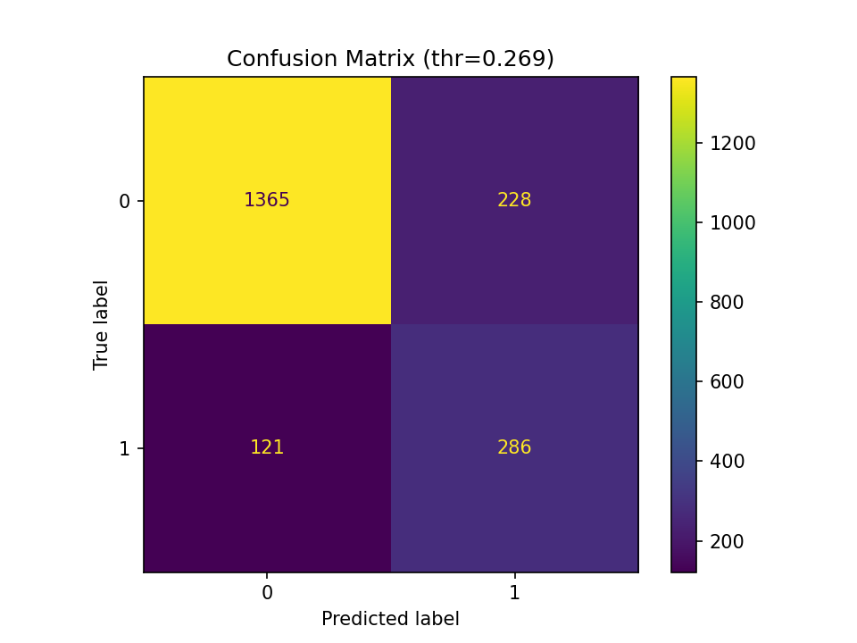
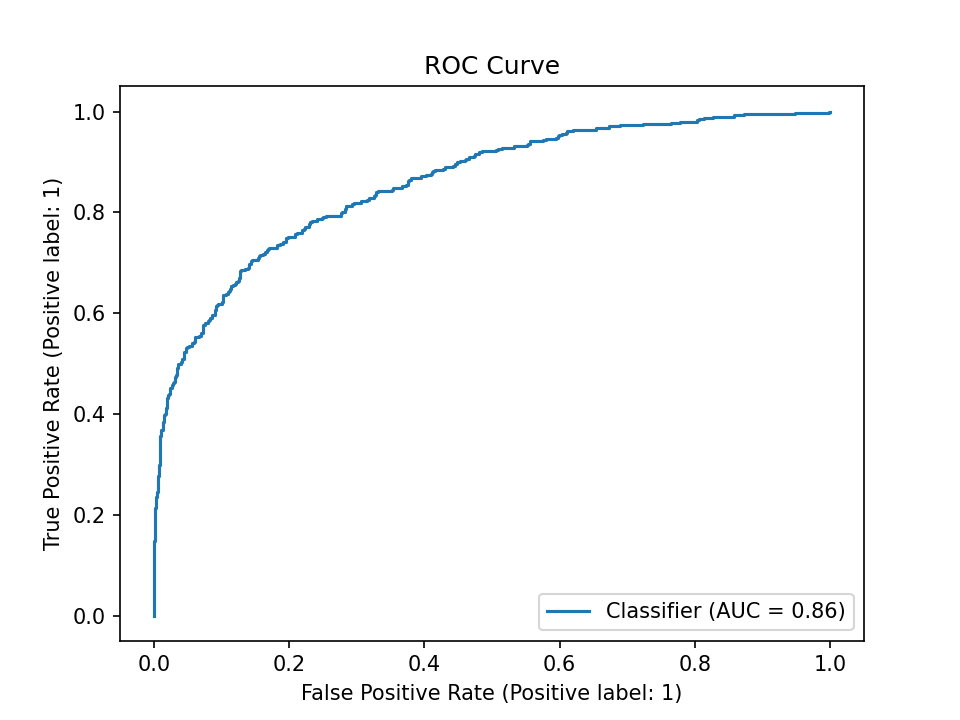

#  Bank Customer Churn Prediction

Predicting which bank customers are likely to churn so the team can prioritize retention outreach.

- **Tech:** Python, pandas, scikit-learn, XGBoost, matplotlib
---

##  Dataset
- **Dataset Link:** https://www.kaggle.com/datasets/gauravtopre/bank-customer-churn-dataset
- **Rows/Cols:** 10,000 × 12
- **Target:** `churn` (1 = churn, 0 = stay)
- **Features:**  
  `credit_score, country, gender, age, tenure, balance, products_number, credit_card, active_member, estimated_salary`  
- **IDs dropped:** `customer_id`

---

##  Approach (end-to-end)
1. Load data, clean column names
2. Drop `customer_id`
3. One-hot encode `country`, `gender` (with `drop_first=True`)
4. Train/test split (80/20, stratified)
5. Scale numeric features for linear models
6. Train **Logistic Regression**, **Random Forest**, **XGBoost**
7. Select best by **ROC-AUC**
8. Tune decision threshold to target higher **recall** (catch more churners)

---

##  Results (Test Set)

- **Model:** XGBoost  
- **Threshold:** 0.269  
- **Accuracy:** 0.826  
- **Precision:** 0.556  
- **Recall:** 0.703  
- **F1:** 0.621  
- **ROC-AUC:** 0.859 

> **Why this threshold?** Lowering the cutoff from 0.50 to 0.269 increases **recall** (we catch more real churners) at the cost of **precision** (more false alarms), a sensible trade-off for retention campaigns.

---

##  What drives churn (feature importance)
Top signals from the best model:
1. `age`
2. `balance`
3. `products_number`
4. `active_member`
5. `credit_score`

---

##  Plots
Saved in `artifacts/`:
- `confusion_matrix.png`
- `roc_curve.png`

